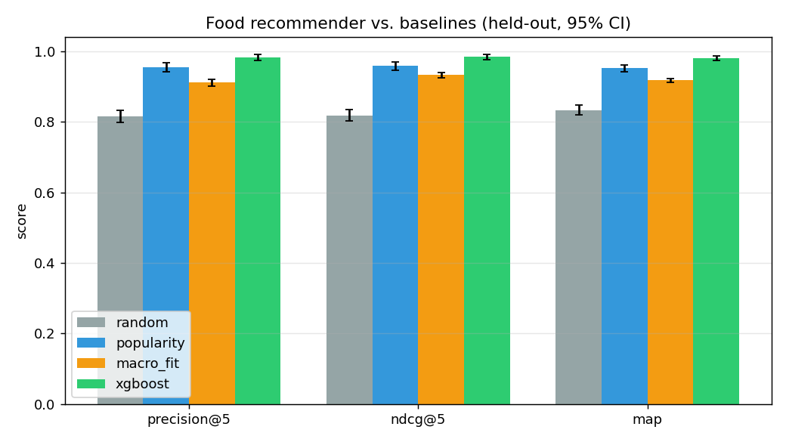

<div align="center">

# 🥗 Macromancer

### A personal, ML-powered nutrition optimizer — macro tracking, a food recommender evaluated against baselines, a local-LLM meal planner, an online-learning RL loop, restaurant search, and a dashboard.

[](https://github.com/Abhiv1028/MacroMancer/actions/workflows/test.yml)
[](#testing)
[](https://www.python.org/)
[](https://fastapi.tiangolo.com/)
[](https://streamlit.io/)
[](https://xgboost.readthedocs.io/)
[](#testing)
[](#deployment-docker)
[](#live-demo--deploy-free-on-hugging-face-spaces-5-min)
[](LICENSE)

</div>

<div align="center">

**[▶️ Run it in one command](#deployment-docker)** &nbsp;·&nbsp; **[🤗 Deploy a free live demo in ~5 min](#live-demo--deploy-free-on-hugging-face-spaces-5-min)** &nbsp;·&nbsp; **[📊 See the evaluation](#recommender-problem-model--evaluation)**

</div>

Macromancer is a full-stack nutrition platform built across **9 phases** — it
loads real USDA food data, computes adaptive calorie/macro targets, recommends
foods with a trained **XGBoost** model, plans meals with a **local LLM**, learns
your preferences with a **contextual-bandit RL loop**, reads restaurant receipts
via **OCR**, finds nearby restaurants on **free APIs**, and wraps it all in a
polished **Streamlit** dashboard — packaged to deploy as a single container.

<div align="center">

| 📊 | Metric | | 📊 | Metric |
|---|---|---|---|---|
| **9** | phases (data → ML → LLM → RL → UI → deploy) | | **37** | REST endpoints |
| **185** | passing tests (19 suites) | | **27** | database models |
| **25** | backend services | | **~8.3k** | lines of Python (66 files) |
| **12-feature** | XGBoost recommender | | **LinUCB** | online RL bandit |

</div>

> **Free & mostly offline.** The core — macro tracking, targets, the XGBoost
> recommender, and the RL loop — runs **fully offline** on SQLite with no keys.
> Optional features use local/free services: chat needs a local **Ollama**, OCR
> needs local **Tesseract**, and nearby search needs network + a free
> **Nutritionix** key. Each degrades gracefully when its service is absent.
>
> ⚕️ **Not medical advice.** Macromancer is a personal/educational project. It
> stores health-related data (weight, body fat, meals) **locally and unencrypted,
> with no authentication** — run it locally or behind your own auth; don't put
> real personal data on a public deployment. See [Limitations](#limitations).

## ✨ What it does

**Phase 1** —
- Loads USDA FoodData Central **Foundation Foods** into SQLite.
- Computes daily macro targets (Mifflin–St Jeor + goal/activity factors).
- Logs meals and derives their macros/calories automatically.
- Recommends the best next foods for your remaining macro budget using an
  **XGBoost** classifier trained on synthetic data (and retrainable from your
  real meal logs).

**Phase 2 (LLM orchestration)** —
- Conversational meal planning at `POST /api/v1/chat`, powered by a **local
  Ollama** model (free, offline). It gathers your remaining macros + the
  optimizer's top foods, prompts the LLM for a JSON meal plan, and persists the
  conversation. Degrades gracefully to a plain-text suggestion when Ollama is
  down. See **Ollama Setup** below.

**Phase 3 (feedback & adaptive TDEE)** —
- Subjective **feedback** (enjoyment/satiety/energy/workout) and **body
  composition** tracking.
- **Adaptive TDEE** recomputed from logged intake + weight trend (energy
  balance), falling back to Mifflin-St Jeor when data is sparse.
- Feedback feeds the recommender two ways: a new `avg_feedback_score` **model
  feature** (used on retrain) and a live **score modifier** (0.8–1.2) applied at
  inference — foods you consistently rate low get downweighted.
- A denormalized `DailySummary` is refreshed via **background tasks** whenever a
  meal, feedback, or body-composition entry is logged.

**Phase 4 (grocery planner & production resilience)** —
- **Grocery lists** generated from a meal plan (explicit or from a chat
  session): duplicates aggregated, quantities scaled by `meal_prep_days`,
  >1000 g shown in kg, items categorized into shopping aisles.
- **Numerical safety**: schema bounds (422, never 500) + output clamping so bad
  or extreme inputs can't overflow.
- **Rate limiting** (slowapi) and **TTL caching** (cachetools) for expensive
  read paths, with cache invalidation on writes. See **Production Resilience**.

**Phase 5 (restaurant mode)** —
- Photograph a **receipt/menu** → local **OCR** (Tesseract) → parse dishes →
  **fuzzy-match** (rapidfuzz) to USDA/custom foods → confirm → log. Logged items
  mirror into `MealLog` so the day's macros stay accurate.
- **Healthier substitutions** for any food (leaner / higher-protein, same
  aisle), ranked by the optimizer.
- OCR is best-effort: if Tesseract is missing the upload endpoint returns **503**
  with install steps, and **manual logging is always available**. See
  **Restaurant Mode (OCR)**.

**Phase 6 (reinforcement learning)** —
- **Part 1 — reward & context**: per-day **reward**
  (`0.5·macro_adherence + 0.3·feedback_avg + 0.2·satiety`) and a normalized
  **context vector** are computed/stored (`RLReward`/`RLState`) whenever a meal
  or feedback is logged (background task).
- **Part 2 — contextual bandit**: a **LinUCB** bandit picks a macro strategy
  (`high_protein`/`balanced`/`low_carb`/`high_fat`) from the context, and
  `POST /api/v1/rl/recommend` returns foods re-ranked to fit that strategy.
  Epsilon-greedy exploration (fully exploratory on cold start); weights persist
  to JSON. See **Reinforcement Learning**.
- **Part 3 — online learning**: once a day's action + reward exist, the bandit
  **updates** from the observed transition (stored as `RLTransition`) and
  re-persists. Fires automatically in the background when a day looks complete
  (dinner logged / evening / feedback), and idempotently (one update per day).
- **Part 4 — evaluation & fallback**: compares average reward on RL days vs
  XGBoost days; if RL underperforms (or a manual override says so),
  `POST /api/v1/rl/recommend` **falls back** to the plain optimizer
  (`used_rl: false`) and logs it. `scripts/retrain_rl.py` re-fits the bandit
  offline from all stored transitions.

**Phase 7 (nearby restaurants)** —
- Find nearby restaurants and rank their menu items against your remaining
  macros — entirely on **free APIs**: IP geolocation (ip-api.com), restaurant
  search (**OpenStreetMap** Overpass), and nutrition (**Nutritionix** free tier),
  with USDA fuzzy matching as fallback. Aggressive caching protects the free
  tiers. See **Nearby Restaurants**.

**Phase 8 (Streamlit frontend)** —
- A polished **dashboard** (`frontend/`) over the whole API:
  Dashboard, Chat, Optimize, Restaurants, Grocery, Feedback, and Body/TDEE
  pages, with macro progress bars, chat bubbles, food cards, and a weight-trend
  chart. See **Frontend (Streamlit)**.

**Phase 9 (deployment)** —
- Single-container **Docker** image (backend + frontend under `supervisord`),
  one-command **Docker Compose**, a free **Hugging Face Spaces** live demo, and
  **GitHub Actions** CI (tests + coverage). See **Deployment**.

## Architecture

```
                         ┌──────────────────────────────────────────┐
                         │        Streamlit UI  (port 8501)          │
                         │  Dashboard · Chat · Optimize · Restaurants│
                         │  Grocery · Feedback · Body/TDEE           │
                         └───────────────────┬──────────────────────┘
                                             │  HTTP (api_client)
                         ┌───────────────────▼──────────────────────┐
                         │         FastAPI backend (port 8000)       │
                         │   rate-limiting · caching · BackgroundTasks│
                         ├───────────────────────────────────────────┤
     USDA CSV ─────────► │  macro engine · XGBoost optimizer         │ ◄─── synthetic
     Ollama (LLM) ◄────► │  LLM meal planner · OCR · fuzzy matcher   │      training data
     OSM + Nutritionix ◄►│  adaptive TDEE · feedback · RL bandit     │
                         └───────────────────┬──────────────────────┘
                                             │  SQLAlchemy ORM
                                   ┌─────────▼─────────┐
                                   │  SQLite  (27 models)│
                                   └────────────────────┘
```

**ML/RL pipeline:** USDA + synthetic data → **XGBoost** food scorer (12 features,
incl. a feedback signal) → **LinUCB contextual bandit** picks a macro strategy →
per-day **reward** (macro adherence + feedback) → **online updates** + offline
retraining → **A/B evaluation** with automatic fallback to XGBoost when RL
underperforms.

## Tech stack

| Layer | Tools |
|---|---|
| **API** | FastAPI · Pydantic v2 · Uvicorn · SQLAlchemy 2.0 · SQLite |
| **ML / RL** | XGBoost · scikit-learn · NumPy · pandas · custom LinUCB bandit |
| **LLM / NLP** | Ollama (local, offline) · rapidfuzz · pytesseract (OCR) |
| **External (free)** | OpenStreetMap Overpass · Nutritionix · ip-api.com |
| **Resilience** | slowapi (rate limiting) · cachetools (TTL caches) · BackgroundTasks |
| **Frontend** | Streamlit · Plotly · custom CSS |
| **DevOps** | Docker · supervisord · Hugging Face Spaces · GitHub Actions |

## Recommender: problem, model & evaluation

**Problem formulation.** At a *decision point* — a user's context plus how much
they've already eaten today — rank candidate foods for the next meal. A food is
**relevant** if a standard serving moves the day's macros toward target *without
overshooting* any macro by more than 20%. This is a binary ranking/classification
task; the model outputs P(relevant) and foods are ranked by it.

**Model.** An `XGBoost` classifier over **12 features**:

| group | features |
|---|---|
| user | `goal` (cut/maintain/bulk), `activity_level` |
| time | `hour_of_day`, `day_of_week` |
| remaining budget | `protein_ratio`, `carbs_ratio`, `fat_ratio` (eaten ÷ target) |
| candidate food | `protein/100g`, `carbs/100g`, `fat/100g`, `calories/100g` |
| preference | `avg_feedback_score` (per-user/food, neutral 3.0 when unrated) |

Trained on ~6k simulated decision points spanning the full eaten-fraction range
(so it sees tight end-of-day budgets where overshoot matters), then retrainable
online from real logs.

**Evaluation.** Held-out contexts + a pool of **42 real foods the model never
trained on**, vs three baselines: `random` (floor), `popularity` (rank by each
food's marginal relevance rate — context-free), and `macro_fit` (a no-ML
heuristic: rank by remaining-macro error reduction). Metrics are averaged over
800 decision points with **bootstrap 95% CIs**.

| Method | precision@5 | NDCG@5 | MAP |
|---|---|---|---|
| random | 0.815 [0.80, 0.83] | 0.819 [0.80, 0.84] | 0.833 [0.82, 0.85] |
| popularity | 0.955 [0.94, 0.97] | 0.959 [0.95, 0.97] | 0.952 [0.94, 0.96] |
| macro_fit (heuristic) | 0.911 [0.90, 0.92] | 0.932 [0.92, 0.94] | 0.918 [0.91, 0.92] |
| **XGBoost (ours)** | **0.982 [0.97, 0.99]** | **0.984 [0.98, 0.99]** | **0.981 [0.97, 0.99]** |

<div align="center"></div>

The learned model beats random, a strong popularity baseline, and the hand-crafted
heuristic on all three ranking metrics with non-overlapping CIs — largely because
it learns the **overshoot penalty** that pure error-reduction (`macro_fit`)
ignores. Honest caveats: the objective is only weakly context-dependent, so the
base rate is high (≈0.82, hence `random`'s precision@5 ≈ 0.82) — NDCG and MAP show
the ranking quality more cleanly; and evaluation uses simulated contexts (real
foods), so treat it as a controlled generalization test, not a field trial.

Reproduce: `python -m scripts.evaluate_recommender` (chart needs `pip install
matplotlib`). See [scripts/evaluate_recommender.py](scripts/evaluate_recommender.py).

## 🚀 Quick start

```bash
git clone https://github.com/Abhiv1028/macromancer.git && cd macromancer
python3 -m venv venv && source venv/bin/activate
pip install -r requirements.txt

python run.py                    # backend  -> http://localhost:8000/docs
streamlit run frontend/app.py    # dashboard -> http://localhost:8501
```

The XGBoost model auto-trains on first start; USDA data, Ollama, Tesseract, and
Nutritionix are all **optional** (each feature degrades gracefully without them).
On macOS you may need `brew install libomp` for XGBoost — see
[**OpenMP / libomp**](#openmp--libomp-required-by-xgboost). Prefer containers?
Jump to [**Deployment**](#deployment-docker--flyio).

## Project structure

```
macromancer/
├── backend/
│   ├── __init__.py
│   ├── main.py              # FastAPI app + lifespan
│   ├── db.py                # engine, session, Base
│   ├── models.py            # SQLAlchemy models
│   ├── schemas.py           # Pydantic models
│   ├── config.py            # settings (env-overridable)
│   ├── rate_limit.py        # slowapi limiter (Phase 4)
│   ├── routes/              # users, foods, meals, optimize, chat, adaptation,
│   │                        #   grocery, restaurant, rl, nearby
│   └── services/            # macro_calculator, usda_loader, optimizer, food_utils,
│                            #   ollama_client, meal_type_detector, tdee_calculator,
│                            #   daily_summary, feedback_adjuster, cache,
│                            #   grocery_categorizer, grocery_generator,
│                            #   ocr_service, menu_parser, food_matcher,
│                            #   substitution_suggester, rl_reward, rl_actions,
│                            #   rl_bandit, rl_online, rl_eval,
│                            #   geo_service, osm_service, nutritionix_service,
│                            #   nearby_optimizer
├── scripts/
│   ├── retrain_rl.py        # offline bandit re-fit from transitions (Phase 6)
│   └── deploy.sh            # Fly.io deploy helper (Phase 9)
├── frontend/                # Phase 8 Streamlit dashboard
│   ├── app.py               #   landing page
│   ├── api_client.py        #   backend API wrapper
│   ├── components/          #   macro_progress, meal_card, chat_message, restaurant_card
│   ├── pages/               #   Dashboard, Chat, Optimize, Restaurants, Grocery, Feedback, Body
│   ├── utils/helpers.py     #   theme, CSS, sidebar, session helpers
│   └── run.sh
├── Dockerfile               # Phase 9: single-container backend + frontend
├── supervisord.conf         #   runs both services
├── fly.toml                 #   Fly.io app config + volume + vm
├── .dockerignore
├── .github/workflows/fly-deploy.yml   # CI auto-deploy on push to main
├── data/
│   ├── download_usda.py     # download + parse + load USDA CSVs
│   ├── food_categories.json # grocery aisle keywords (Phase 4)
│   └── synthetic_data_generator.py
├── ml/
│   ├── train_model.py
│   └── xgboost_macro_model.json   # generated
├── tests/                   # pytest suite (macros, api, chat)
├── requirements.txt
├── run.py                   # uvicorn wrapper
└── test_api.py              # end-to-end smoke test
```

## Setup

```bash
# From the project root (macromancer/)
python3 -m venv venv
source venv/bin/activate            # Windows: venv\Scripts\activate
pip install --upgrade pip
pip install -r requirements.txt
```

## 1. Load USDA foods (optional but recommended)

```bash
python -m data.download_usda            # add --force to re-download
```

This downloads the Foundation Foods CSV bundle, auto-discovering a working URL
from the USDA site if the default link is stale, then parses it into SQLite
(`macromentor.db`). If the download fails, the command prints exact
instructions for manually placing the CSVs under `data/usda_csv/`.

> The app works without USDA data too — you can add custom foods via
> `POST /foods`. The optimizer trains on **synthetic** data, so it never
> depends on the USDA download.

## OpenMP / libomp (required by XGBoost)

XGBoost links against the OpenMP runtime. Install it once:

```bash
# macOS
brew install libomp
# Debian / Ubuntu
sudo apt-get install libomp-dev      # or: libgomp1
# Conda
conda install -c conda-forge libomp
```

**No Homebrew on macOS?** scikit-learn (already a dependency) ships a compatible
`libomp.dylib`. Point the dynamic loader at it before launching:

```bash
export DYLD_LIBRARY_PATH="$(python -c 'import os,sklearn;print(os.path.join(os.path.dirname(sklearn.__file__),".dylibs"))'):$DYLD_LIBRARY_PATH"
```

If the runtime is missing, any ML call raises a clear error explaining exactly
what to install — the rest of the API (users, foods, meals, targets) still works.

## Ollama Setup (for chat endpoint)

The `POST /api/v1/chat` endpoint uses a **local Ollama** model — free and
offline. It is optional: if Ollama isn't running, `/chat` falls back to a
plain-text suggestion from the optimizer (`meal_plan: null`).

1. Install & start Ollama: `brew install ollama && ollama serve`
2. Pull a model: `ollama pull llama3.2:3b`
3. Ensure Ollama is running before using `/chat`.

Configure via env vars (defaults shown):

```bash
OLLAMA_BASE_URL=http://localhost:11434/api/generate
OLLAMA_MODEL=llama3.2:3b
```

## 2. Train the model (optional — auto-trains on first start)

```bash
python -m ml.train_model                # fresh synthetic training
python -m ml.train_model --logs         # retrain from your meal logs
```

If no model exists when the server starts, it auto-trains on synthetic data.

## 3. Run the server

```bash
python run.py
# open http://localhost:8000/docs
```

Environment overrides: `HOST`, `PORT`, `RELOAD=true`.

## Testing

**185 tests across 19 suites** cover macro math, the ML optimizer, the LLM chat
fallback, OCR/fuzzy matching, the full RL loop (reward → bandit → online learning
→ evaluation), caching/rate-limiting, and every route. They run with **no running
server, no network, and no libomp required** — external services are mocked and
the one optimizer test auto-skips if XGBoost can't load.

```bash
pytest -q          # -> 185 passed
```

Coverage by area:

| Suite | What it checks |
|---|---|
| `test_macros`, `test_safety` | Mifflin–St Jeor, clamping, input bounds (422 not 500) |
| `test_api_endpoints`, `test_body_comp`, `test_tdee` | users, foods, meals, targets, adaptive TDEE |
| `test_chat` | LLM meal planning + graceful fallback |
| `test_grocery`, `test_nearby`, `test_ocr`, `test_menu_parser`, `test_food_matcher` | grocery lists, restaurants, OCR, fuzzy matching |
| `test_rl_reward` · `test_rl_bandit` · `test_rl_online` · `test_rl_eval` | the full RL layer end-to-end |

For a live smoke test against a running server:

```bash
python run.py                           # terminal 1
python test_api.py                      # terminal 2  (create user → log meal → optimize → train)
```

## API summary

| Method & path                         | Purpose                                            |
|---------------------------------------|----------------------------------------------------|
| `POST /users`                         | Create user; compute & store today's macro targets |
| `GET /users/{id}/targets?date=&days=` | Targets from `date` for `days` days (auto-generates); returns a list |
| `POST /foods`                         | Add a custom food (macros/100g + optional portions)|
| `GET /foods?search=&skip=&limit=`     | Search USDA + custom foods (paginated)             |
| `POST /meals`                         | Log a meal (macros/calories auto-derived)          |
| `GET /meals?user_id=&date=`           | List a user's logged meals · `DELETE /meals/{id}`  |
| `POST /optimize`                      | Top-5 food recommendations for remaining macros    |
| `POST /train?run_async=true`          | Retrain from meal logs incl. `avg_feedback_score` feature |
| `POST /api/v1/chat`                   | Conversational meal planning via local Ollama LLM  |
| `POST /api/v1/feedback`               | Record enjoyment/satiety/energy/workout feedback   |
| `POST /api/v1/body_composition`       | Log weight/body-fat/lean mass; recalc macro targets|
| `GET /api/v1/users/{id}/tdee`         | Static vs adaptive TDEE (updates targets if >5% off)|
| `PUT /api/v1/users/{id}/goals`        | Change goal; recompute targets from latest TDEE    |
| `POST /api/v1/grocery_lists`          | Build a grocery list from a meal plan or session   |
| `GET /api/v1/grocery_lists/{id}`      | Fetch a grocery list with items                    |
| `PUT /api/v1/grocery_items/{id}`      | Toggle an item's `checked` state                   |
| `DELETE /api/v1/grocery_lists/{id}`   | Delete a grocery list and its items                |
| `POST /api/v1/restaurant/upload_receipt` | OCR a receipt image → parsed dishes + food matches |
| `POST /api/v1/restaurant/log_meal`    | Log a restaurant meal (mirrors into MealLog)       |
| `GET /api/v1/restaurant/logs/{user_id}` | List a user's restaurant logs                    |
| `POST /api/v1/restaurant/substitute`  | Suggest healthier substitutions for a food         |
| `POST /api/v1/rl/compute_reward`      | (Re)compute a user/day's RL reward + context       |
| `GET /api/v1/rl/rewards/{user_id}`    | List a user's daily rewards (date-range optional)  |
| `POST /api/v1/rl/recommend`           | Bandit picks a macro strategy → strategy-fit foods |
| `POST /api/v1/rl/update`              | Online bandit update from a user/day (idempotent)  |
| `GET /api/v1/rl/status`               | Bandit update count, epsilon, dims                 |
| `GET /api/v1/rl/evaluate/{user_id}`   | RL-vs-XGBoost reward comparison + recommendation   |
| `POST /api/v1/rl/switch`              | Force RL on/off for a user (manual override)       |
| `GET /api/v1/nearby/search`           | Nearby restaurants + macro-ranked menu items       |
| `POST /api/v1/nearby/log`             | Log a nearby-restaurant menu item as a meal        |

### `POST /optimize` request

```json
{
  "user_id": 1,
  "current_macros": { "protein_g": 54, "carbs_g": 0, "fat_g": 6 },
  "meal_type": "dinner",
  "available_food_ids": [2, 3, 4]
}
```

If `available_food_ids` is omitted, the top-5 are drawn from all foods with
≤ 800 kcal/100g.

### `POST /api/v1/chat` request / response

```jsonc
// request
{ "user_id": 1, "session_id": null, "message": "What should I have for dinner?" }

// response (Ollama running)
{
  "message": "A lean, high-protein plate to close your remaining macros.",
  "meal_plan": {
    "meal_name": "Chicken & rice bowl",
    "foods": [{ "food_id": 1, "name": "Chicken", "grams": 150 }],
    "total_macros": { "protein_g": 46.5, "carbs_g": 0, "fat_g": 5.4, "calories": 235 },
    "explanation": "..."
  },
  "session_id": 1
}

// response (Ollama down — graceful fallback)
{ "message": "Ollama unavailable. Here's the top suggestion: Chicken - 100.0g.",
  "meal_plan": null, "session_id": 1 }
```

Omit `session_id` to start a new conversation; pass it back to continue one.

### Phase 3: feedback, body composition & adaptive TDEE

```jsonc
// POST /api/v1/feedback
{ "user_id": 1, "meal_log_id": 12, "enjoyment": 5, "satiety": 4, "energy": 4,
  "workout_performance": 3, "notes": "great" }        // -> { status, feedback_id }

// POST /api/v1/body_composition  (date optional, defaults today)
{ "user_id": 1, "weight_kg": 72, "body_fat_percent": 15, "lean_mass_kg": 61 }
// -> body comp + recalculated macro targets; user's weight is updated

// GET /api/v1/users/1/tdee
// -> { current_tdee, adaptive_tdee, last_updated, method_used }

// PUT /api/v1/users/1/goals
{ "goal": "bulk" }   // -> targets recomputed from the latest (adaptive) TDEE
```

**Adaptive TDEE** = `(total_intake + weight_change_kg × 7700) / days` over the
look-back window (default 14 days). It needs ≥ 7 days of intake and ≥ 2 weight
measurements; otherwise it reports `method_used: "mifflin"` and
`adaptive_tdee: null`.

**Background jobs.** Logging a meal, feedback, or body-composition entry queues a
FastAPI `BackgroundTask` that refreshes that day's `DailySummary` (intake totals
+ latest weight), which powers the adaptive-TDEE math. For a scheduled nightly
recompute across all users, wrap `daily_summary.update_daily_summary(db, user_id,
day)` in an APScheduler/cron job — no code change needed.

### Migration / upgrading

New tables are created automatically on startup via
`SQLAlchemy Base.metadata.create_all`; existing tables/data are untouched.

1. **Install deps** — Phase 4 adds `slowapi`/`cachetools`; Phase 5 adds
   `pytesseract`/`Pillow`/`rapidfuzz`; Phase 6 adds `numpy`:
   `pip install -r requirements.txt` (plus the Tesseract engine — see
   **Restaurant Mode**).
2. **Restart the server** — creates Phase 3 tables (`feedbacks`,
   `body_compositions`, `daily_summaries`), Phase 4 tables (`grocery_lists`,
   `grocery_items`), Phase 5 tables (`restaurant_logs`, `restaurant_items`), and
   Phase 6 tables (`rl_actions`, `rl_states`, `rl_rewards`, `rl_action_logs`,
   `rl_transitions`, `rl_fallback_logs`, `rl_overrides`, `rl_daily_performance`),
   and Phase 7 tables (`nearby_search_caches`, `restaurant_caches`,
   `cached_menu_items`, `restaurant_meal_logs`) if missing. The RL action space is
   seeded on startup (idempotent); bandit weights persist to
   `data/rl_bandit_weights.json`.
3. The optimizer **auto-retrains** on next use if the persisted model's feature
   count is stale (11 → 12 features after Phase 3), or run
   `python -m ml.train_model`.

### Phase 4: grocery lists / meal prep

```bash
# 1) Build a grocery list from an explicit meal plan (2 days of prep).
curl -s -X POST localhost:8000/api/v1/grocery_lists -H 'Content-Type: application/json' -d '{
  "user_id": 1, "name": "Weekly Prep", "meal_prep_days": 2,
  "meal_plan": [
    {"name": "Chicken Breast", "grams": 400},
    {"name": "Broccoli", "grams": 200},
    {"name": "Chicken Breast", "grams": 200}
  ]
}'
# -> duplicates summed & scaled: Chicken Breast (400+200)*2 = 1200 g -> 1.2 kg (meat),
#    Broccoli 400 g (produce).

# 2) Build a grocery list from the latest meal plan in a chat SESSION.
curl -s -X POST localhost:8000/api/v1/grocery_lists -H 'Content-Type: application/json' \
  -d '{"user_id": 1, "session_id": 1}'

# 3) Or just ask in chat — a list is generated automatically.
curl -s -X POST localhost:8000/api/v1/chat -H 'Content-Type: application/json' \
  -d '{"user_id": 1, "message": "give me a grocery list for meal prep this week"}'
# -> response includes "grocery_list_id": 5

# 4) Fetch, check off an item, delete.
curl -s localhost:8000/api/v1/grocery_lists/5
curl -s -X PUT localhost:8000/api/v1/grocery_items/12        # toggles `checked`
curl -s -X DELETE localhost:8000/api/v1/grocery_lists/5
```

Categories come from [data/food_categories.json](data/food_categories.json)
(`produce`, `dairy`, `meat`, `seafood`, `pantry`, `frozen`, `spices`, `other`) —
edit that file to tune categorization; the longest matching keyword wins.

## Restaurant Mode (OCR)

Photograph a receipt/menu, parse the dishes, match them to foods, and log.

**Install Tesseract** (the OCR engine — the Python bindings alone aren't enough):

```bash
# macOS
brew install tesseract tesseract-lang
# Debian / Ubuntu
sudo apt-get install tesseract-ocr
# Windows: https://github.com/UB-Mannheim/tesseract/wiki
```

Without Tesseract, `upload_receipt` returns **503** with these instructions —
**manual logging via `log_meal` always works** (OCR is best-effort).

```bash
# 1) Upload a receipt image -> parsed dishes + provisional food matches (no logging yet).
curl -s -X POST localhost:8000/api/v1/restaurant/upload_receipt \
  -F "user_id=1" -F "file=@receipt.jpg;type=image/jpeg"
# -> { "receipt_text": "...", "parsed_items": [
#       {"dish_name":"Grilled Chicken Breast","matched_food":{"id":3,"name":"..."},
#        "confidence":92.0,"suggested_grams":150.0,"warning":null}, ... ] }
#    Unmatched dishes come back with matched_food:null and a warning.

# 2) Confirm and log (also mirrored into MealLog so daily macros update).
curl -s -X POST localhost:8000/api/v1/restaurant/log_meal -H 'Content-Type: application/json' -d '{
  "user_id": 1, "restaurant_name": "The Green Fork", "notes": "date night",
  "items": [{"food_id": 3, "grams": 200}, {"food_id": 7, "grams": 150}]
}'

# 3) Review past restaurant visits.
curl -s localhost:8000/api/v1/restaurant/logs/1

# 4) Ask for a healthier swap for a food.
curl -s -X POST localhost:8000/api/v1/restaurant/substitute -H 'Content-Type: application/json' \
  -d '{"user_id": 1, "food_id": 3, "limit": 3}'
```

`upload_receipt` is rate limited to 10/min (OCR is slow); fuzzy-match results are
cached for a day (invalidated when a food is added).

## Reinforcement Learning (Phase 6)

Macromancer is growing an RL layer that learns which **macro strategy** to steer
a user toward. **Part 1** lays the data + reward foundation:

- **Reward** (`backend/services/rl_reward.py`): a daily scalar in `[0, 1]`
  ```
  reward = 0.5·macro_adherence + 0.3·feedback_avg + 0.2·satiety_norm
  ```
  where `macro_adherence = clamp(1 − mean(|target − eaten| / target), 0, 1)`,
  `feedback_avg = mean(enjoyment, energy)/5`, and `satiety_norm = mean(satiety)/5`
  (satiety is kept out of `feedback_avg` so it isn't double-counted).
  Feedback terms are 0 on days with no logged feedback. Stored idempotently in
  `RLReward` (one row per user/day) with a `components` breakdown.
- **Context** (`build_context`): a normalized `[0,1]` feature vector —
  `[protein_remaining_ratio, carbs_remaining_ratio, fat_remaining_ratio, hour,
  day_of_week, goal_encoded, activity_level_encoded]` — stored in `RLState`.
- **Action space** (`backend/services/rl_actions.py`): fixed macro strategies
  `high_protein` (≥35% protein), `balanced` (25/45/30), `low_carb` (<30% carbs),
  `high_fat` (≥35% fat), seeded into `rl_actions` on startup. Used by later parts.
- **Auto-update**: logging a meal (`POST /meals`) or feedback
  (`POST /api/v1/feedback`) fires a `BackgroundTask` that recomputes that day's
  reward + context — no blocking of the response.

```bash
# Backfill / recompute a day's reward and context.
curl -s -X POST localhost:8000/api/v1/rl/compute_reward \
  -H 'Content-Type: application/json' -d '{"user_id": 1, "date": "2026-07-09"}'
# -> { "reward": 0.62, "components": {...}, "context": {...} }

# Reward history (optionally bounded).
curl -s "localhost:8000/api/v1/rl/rewards/1?start_date=2026-07-01&end_date=2026-07-09"
```

**Part 2 — contextual bandit** (`backend/services/rl_bandit.py`):

- **LinUCB**: each action (arm) keeps ridge-regression stats `A` (d×d) and `b`
  (d); `select_action` is **epsilon-greedy** with `ε = max(0.05, 1/√(updates+1))`,
  so a fresh bandit explores uniformly and exploits more as it learns. Weights
  persist to `data/rl_bandit_weights.json` (`RL_BANDIT_PATH` to override) and load
  on startup. **Scope:** this is a **single global bandit** shared across users —
  selection is still personalized through the context vector, but the learned
  weights are shared (a deliberate simplification; per-user bandits would key
  weights by `user_id`). See [Limitations](#limitations).
- **Action → macros** (`rl_actions.apply_action`): the chosen strategy's calorie
  split is applied to the user's remaining calories → `{protein_g, carbs_g,
  fat_g, calories}`.
- **Strategy-fit ranking**: `optimizer.get_top_recommendations(..., target_macros=)`
  blends the XGBoost score with each candidate's macro-split fit, so
  `high_protein` surfaces protein-dense foods, `high_fat` surfaces fatty foods,
  etc. Each selection is logged to `RLActionLog` (used for online learning in
  Part 3).

```bash
# RL-boosted recommendation: bandit selects a strategy, foods fit it.
curl -s -X POST localhost:8000/api/v1/rl/recommend \
  -H 'Content-Type: application/json' -d '{"user_id": 1, "meal_type": "dinner"}'
# -> { "action_name": "high_protein",
#      "recommended_macros": {"protein_g": 234, "carbs_g": 205, "fat_g": 65, "calories": 2345},
#      "foods": [ {"name": "Salmon", ...}, {"name": "Chicken Breast", ...}, ... ],
#      "used_rl": true }
```

**Part 3 — online learning** (`backend/services/rl_online.py`):

`update_bandit_from_day(user_id, day)` joins the day's `RLActionLog` (context +
action) with its `RLReward`, runs a LinUCB `update(action, context, reward)`,
saves an `RLTransition` (with the next day's state, if any), and re-persists the
weights. It's **idempotent** (one transition per day's reward) and **skips**
cleanly when the action log or reward is missing.

The update fires automatically: logging a meal or feedback recomputes the day's
reward in the background and, when the day looks complete (dinner / after 20:00 /
feedback given), performs the online update. Trigger/inspect it manually:

```bash
# Manually run the online update for a user/day (idempotent).
curl -s -X POST localhost:8000/api/v1/rl/update \
  -H 'Content-Type: application/json' -d '{"user_id": 1}'
# -> { "status": "updated", "action": "high_fat", "reward": 0.62,
#      "update_count": 1, "transition_id": 1 }   (then "skipped"/"already_updated")

# Inspect bandit state.
curl -s localhost:8000/api/v1/rl/status
# -> { "update_count": 1, "epsilon": 0.707, "n_actions": 4, "context_dim": 7, ... }
```

**Part 4 — evaluation & fallback** (`backend/services/rl_eval.py`):

`evaluate_rl_vs_xgboost(user_id, days)` splits the window into **RL days** (an
action was logged) and **XGBoost days** (none was) and compares mean reward.
`POST /api/v1/rl/recommend` calls it first: if RL underperforms it **bypasses the
bandit**, returns the plain optimizer's foods with `used_rl: false`, and records
an `RLFallbackLog`. A manual `RLOverride` (via `/rl/switch`) always wins. With
fewer than 5 labeled days per group the result is `insufficient_data` — RL keeps
running so it can gather experience.

```bash
# Evaluation report.
curl -s localhost:8000/api/v1/rl/evaluate/1
# -> { "rl_avg_reward": 0.72, "xgboost_avg_reward": 0.61, "improvement_percent": 18.0,
#      "recommendation": "use_rl", "rl_days": 8, "xgboost_days": 6 }

# Force RL off (or on) for a user.
curl -s -X POST localhost:8000/api/v1/rl/switch \
  -H 'Content-Type: application/json' -d '{"user_id": 1, "force_rl": false}'

# Offline: re-fit the bandit from ALL stored transitions (manual / cron).
python -m scripts.retrain_rl
# -> [retrain_rl] Replayed N transitions ...; saved bandit -> data/rl_bandit_weights.json
```

## Deployment (Docker)

Both services ship in **one container**: the FastAPI backend (`:8000`) and the
Streamlit UI (`:8501`) run under `supervisord`. Public traffic hits the UI; the
UI calls the backend at `http://localhost:8000` inside the container. The image
runs as a non-root user and installs only runtime libs (`libgomp1` for XGBoost,
`tesseract-ocr` for OCR) — no build toolchain, so it stays lean.

**Files**: [Dockerfile](Dockerfile) · [docker-compose.yml](docker-compose.yml) ·
[supervisord.conf](supervisord.conf) · [.dockerignore](.dockerignore)

### Run the whole stack in one command

```bash
docker compose up --build
# UI:  http://localhost:8501     API: http://localhost:8000/docs
```

`SEED_DEMO=true` (set in compose) seeds ~40 foods and a demo user on first boot,
so the app is immediately usable. The SQLite DB and RL weights persist in a named
volume (`/data`). Plain `docker run` works too:

```bash
docker build -t macromancer .
docker run --rm -p 8000:8000 -p 8501:8501 -e SEED_DEMO=true macromancer
```

### Live demo — deploy free on Hugging Face Spaces (~5 min)

The repo doubles as a **Docker Space**: the root `README.md` front-matter
(`sdk: docker`, `app_port: 8501`) tells HF to build the `Dockerfile` and serve
the UI. It's free (2 vCPU / 16 GB), no credit card, and gives a public URL.

```bash
# 1) Create a Space:  huggingface.co/new-space  → SDK: Docker → Blank
# 2) Push this repo to it (the Space is just another git remote):
git remote add hf https://huggingface.co/spaces/<your-username>/macromancer
git push hf main
# 3) HF builds the Dockerfile and serves the UI at:
#    https://<your-username>-macromancer.hf.space
```

Optional: add `NUTRITIONIX_APP_ID` / `NUTRITIONIX_API_KEY` as Space **Variables**
to enable restaurant search. On the free tier storage is ephemeral — the demo
re-seeds on restart, which is exactly what you want for a public demo.

**Notes:**
- `MACROMANCER_API_URL=http://localhost:8000` — the UI reaches the backend
  *inside* the container; HF exposes only the UI port (8501).
- Mutable state lives under `/data` (`DATABASE_URL=sqlite:////data/...`,
  `RL_BANDIT_PATH`). The XGBoost model ships in the image and loads on boot.
- **Ollama** isn't bundled — chat degrades to a plain suggestion when it's
  absent (connection-refused → fallback), so the cloud demo needs nothing extra.
- Other Docker hosts (Render, Railway, a VPS) work from the same `Dockerfile`.
  A legacy `fly.toml` is kept for reference, but Fly.io removed its free tier.

## Frontend (Streamlit)

A beautiful multi-page dashboard that wraps the whole backend — for non-developers.

```bash
pip install -r requirements.txt          # adds streamlit + plotly
python run.py                            # 1) start the backend (port 8000)
streamlit run frontend/app.py            # 2) start the UI  -> http://localhost:8501
# or: ./frontend/run.sh
# point the UI at a remote backend:
MACROMANCER_API_URL=http://my-host:8000 streamlit run frontend/app.py
```

**Pages** (sidebar has a user selector + live quick stats): **Dashboard**
(calorie hero + macro progress + today's meals), **Chat** (LLM meal planning with
"Log this meal"), **Optimize** (ML food picks with one-click logging),
**Restaurants** (nearby search + macro-friendly items), **Grocery** (aisle-grouped
checklist), **Feedback** (rate meals 1–5), **Body & TDEE** (log weight, recalc
targets, weight-trend chart).

Design: nutrition-green/blue/orange palette, rounded cards with hover lift, color
coded progress (green on-track / orange close / red off), custom CSS, emojis, and
friendly error toasts ("Cannot connect to the backend…").

> Fully persisted across sessions: the dashboard, grocery, and body pages read
> from `GET /meals`, `GET /grocery_lists`, and
> `GET /body_composition/history/{id}` (with `DELETE /meals/{id}` for removing a
> meal), so what you log survives a refresh.

## Nearby Restaurants

Find restaurants near you and get menu items ranked for your remaining macros —
using only **free** services (no credit card):

- **Geolocation**: ip-api.com (no key) — or pass `lat`/`lon` directly.
- **Restaurant search**: OpenStreetMap Overpass (no key), client-side throttled to
  1 req/s, results cached 1 hour (`NearbySearchCache`).
- **Nutrition**: Nutritionix free tier — menus cached 7 days (`RestaurantCache`).
- **RL-aware**: when RL is active for the user, the bandit picks a macro strategy
  and items are ranked to fit it; otherwise they're ranked against remaining
  macros. Falls back gracefully (macro-fit only) if the model is unavailable.

**Setup** — register (free, no card) at
<https://www.nutritionix.com/business/api> and set:

```bash
export NUTRITIONIX_APP_ID=your_app_id
export NUTRITIONIX_API_KEY=your_api_key
# optional:
export NEARBY_SEARCH_RADIUS_DEFAULT=2000
```

Without a Nutritionix key, `GET /nearby/search` returns **503** with these setup
instructions.

```bash
# Search near explicit coordinates (or omit lat/lon to use IP geolocation).
curl -s "localhost:8000/api/v1/nearby/search?user_id=1&lat=40.7128&lon=-74.0060&radius=2000"
# -> { "location": "New York, NY", "used_rl": true, "action_name": "high_protein",
#      "restaurants": [ { "name": "Sweetgreen", "address": "123 Broadway",
#        "menu_items": [ { "name": "Harvest Bowl", "calories": 650, "protein_g": 32,
#          "carbs_g": 45, "fat_g": 28, "macro_fit": 0.89, "score": 0.92 } ] } ] }

# Log a menu item you picked (macros come from the cached item).
curl -s -X POST localhost:8000/api/v1/nearby/log -H 'Content-Type: application/json' \
  -d '{"user_id": 1, "restaurant_name": "Sweetgreen", "item_name": "Harvest Bowl", "grams": 350}'
# -> creates a MealLog (+RestaurantMealLog) and prompts for feedback.
```

`/nearby/search` is rate limited to 5/min per IP (OSM fair-use).

## Production Resilience

**Rate limiting** (slowapi, per-IP): `POST /api/v1/chat` 10/min, `POST /optimize`
30/min, `POST /api/v1/feedback` & `/body_composition` 60/min. Exceeding a limit
returns **HTTP 429**. Disable for local dev / CI:

```bash
export DISABLE_RATELIMIT=1
```

**Caching** (cachetools TTL, in-process):
- `GET /foods?search=` cached 5 min; invalidated when a food is created.
- `POST /optimize` cached 60 s per user + rounded macros + meal_type + candidate
  set; invalidated when that user logs a meal.

**Async & background tasks**: `/api/v1/chat` awaits Ollama via `httpx.AsyncClient`
(never blocks the loop); `/train` runs in a `BackgroundTask` (returns immediately,
errors are caught and logged); logging a meal fires a background `DailySummary`
refresh.

**Numerical safety**: request fields are bounded via Pydantic (`age` 10–120,
`weight_kg` 20–400, `height_cm` 50–300, protein/carbs 0–1000, fat 0–500,
calories 0–10000) → out-of-range inputs get **422**, not 500. All macro/TDEE
outputs are clamped (`macro_calculator.clamp`), and adaptive TDEE falls back to
Mifflin-St Jeor on division-by-zero or implausible weight change (>5 kg/day).

**Database pooling**: SQLite for dev (`check_same_thread=False`).
[backend/db.py](backend/db.py) includes commented PostgreSQL config
(`pool_size=20`, `max_overflow=10`, plus an `asyncpg` async-engine sketch) — set
`DATABASE_URL=postgresql+psycopg://…` to switch.

## Macro math

- **BMR** (Mifflin–St Jeor): `10·kg + 6.25·cm − 5·age + s` (s = +5 male, −161 female; female by default).
- **TDEE**: BMR × {sedentary 1.2, light 1.375, moderate 1.55, very 1.725, extra 1.9}.
- **Goal**: cut ×0.85, maintain ×1.0, bulk ×1.15.
- **Protein**: 2.2 g/kg (cap 250 g). **Fat**: 0.8 g/kg (min 40 g).
  **Carbs**: `(calories − 4·protein − 9·fat) / 4`.

## Limitations

Honest scope — this is a portfolio/educational project, not a production service:

- **No auth / not multi-tenant-safe.** Any client can read any `user_id`. Health
  data is stored **unencrypted** in SQLite. Fine for local/demo use; add auth +
  encryption before hosting real data.
- **SQLite + single worker.** SQLite is a single-writer store, and the TTL caches
  and `BackgroundTasks` live in-process — so run **one** Uvicorn worker. For real
  scale, move to PostgreSQL + Redis + a task queue (the code isolates the DB layer
  behind SQLAlchemy to make this swap straightforward).
- **Evaluation uses simulated contexts** (with 42 real foods). It's a controlled
  generalization test, not a user study — see
  [Recommender evaluation](#recommender-problem-model--evaluation).
- **RL bandit weights are global**, not per-user (one shared `LinUCB`). The
  context vector personalizes selection, but learning is shared across users —
  documented in [Reinforcement Learning](#reinforcement-learning-phase-6).
- **`BackgroundTasks` aren't durable** (lost on restart, no retries); the demo
  DB on Hugging Face is **ephemeral** (re-seeds on restart).
- **Migrations:** schema is created with `create_all`; there's no Alembic yet, so
  column changes to an existing DB need a manual migration.

## Notes

- Database file: `macromentor.db` (SQLite) in the project root.
- Model file: `ml/xgboost_macro_model.json`.
- Python 3.9+ supported.
